# LiDAR Tabanlı Otonom Navigasyon: Sensör Füzyonu ve Lokalizasyon

**Mobil Robotlar Dersi — Ödev 1**  
Öğrenci: Tahir Can Kozan | 21406601051 | Mayıs 2026

---

## İçindekiler

- [Proje Hakkında](#proje-hakkında)
- [Özellikler](#özellikler)
- [Kurulum](#kurulum)
- [Kullanım](#kullanım)
- [Proje Yapısı](#proje-yapısı)
- [Teknik Detaylar](#teknik-detaylar)
- [Sonuçlar](#sonuçlar)
- [Yapay Zeka Kullanım Beyanı](#yapay-zeka-kullanım-beyanı)

---

## Proje Hakkında

50×50 grid (25m × 25m) fabrika/depo ortamında 11 farklı robot modeli kullanarak **LiDAR tabanlı otonom navigasyon** simülatörü. LiDAR + IMU + tekerlek enkoderi verilerinin **Genişletilmiş Kalman Filtresi (EKF)** ile füzyonu gerçekleştirilmektedir. A\*, Dijkstra, D\* Lite, RRT, RRT\* ve reaktif planlayıcılar (Bug1, Bug2, Potential Fields, VFH) karşılaştırmalı olarak test edilmiştir.

> **Senaryo:** Başlangıç (1.0 m, 1.0 m) → Hedef (23.5 m, 23.5 m), 12 dikdörtgen engel, sensör gürültülü ortam.

---

## Özellikler

### Robot Modelleri (11 adet)

| Robot | Kinematik Model | Tip |
|---|---|---|
| `differential` | Unicycle | Non-holonomik |
| `ackermann` | Bicycle | Non-holonomik |
| `fixedwing` | Pure Pursuit lookahead | Non-holonomik |
| `snake` | Eklem zinciri | Non-holonomik |
| `bipedal` | Adım tabanlı yürüyüş | Non-holonomik |
| `omni` | 3 tekerlekli omni | Holonomik |
| `mecanum` | 4 tekerlekli Mecanum | Holonomik |
| `quadruped` | Dörtgen yürüyüş | Holonomik |
| `hexapod` | Altıgen yürüyüş | Holonomik |
| `drone` | Quadrotor X-config | Holonomik |
| `vtol` | Hibrit hover+cruise | Holonomik |

### Yol Planlayıcılar

| Planlayıcı | Tür | Parametreler |
|---|---|---|
| `astar` | Global | euclidean, manhattan, chebyshev, diagonal, octile, minkowski2, minkowski3 |
| `dijkstra` | Global | aynı metrikler |
| `dstar` | Global (dinamik) | aynı metrikler |
| `rrt` | Örnekleme tabanlı | aynı metrikler |
| `rrtstar` | Örnekleme tabanlı | aynı metrikler |
| `bug1` / `bug2` | Reaktif lokal | — |
| `potentialfields` | Reaktif lokal | — |
| `vfh` | Reaktif lokal | — |

### Yol Kriterleri

`shortest` · `safest` · `fastest` · `smoothest` · `reaktif`

---

## Kurulum

**Gereksinimler:** Python 3.10+

```bash
git clone https://github.com/KULLANICI_ADIN/mobil-robotlar-odev1.git
cd mobil-robotlar-odev1
pip install -r requirements.txt
```

`requirements.txt`:
```
contourpy==1.3.3
cycler==0.12.1
fonttools==4.63.0
kiwisolver==1.5.0
matplotlib==3.10.9
numpy==2.4.4
packaging==26.2
pillow==12.2.0
pygame-ce==2.5.7
pyparsing==3.3.2
python-dateutil==2.9.0.post0
six==1.17.0
```

---

## Kullanım

### Hızlı Başlangıç

```bash
# Varsayılan ayarlarla çalıştır (differential + A* + euclidean + shortest)
python main.py

# Robot tipi seç
python main.py --robot ackermann

# Planlayıcı ve metrik seç
python main.py --robot differential --planner astar --metric manhattan --criteria safest

# Etkileşimli menü
python main.py --interactive

# Tüm seçenekleri listele
python main.py --list
```

### Toplu Simülasyon (Ödev Modu)

```bash
# Tüm robot kombinasyonlarını çalıştır ve rapor üret
python assignment_runner.py
```

### Seçenekler

| Parametre | Seçenekler |
|---|---|
| `--robot` | `differential`, `ackermann`, `fixedwing`, `omni`, `mecanum`, `drone`, `vtol`, `quadruped`, `hexapod`, `snake`, `bipedal` |
| `--planner` | `astar`, `dijkstra`, `dstar`, `rrt`, `rrt*`, `bug1`, `bug2`, `potentialfields`, `vfh` |
| `--metric` | `euclidean`, `manhattan`, `chebyshev`, `diagonal`, `octile`, `minkowski2`, `minkowski3` |
| `--criteria` | `shortest`, `safest`, `fastest`, `smoothest` |

---

## Proje Yapısı

```
├── main.py                    # Giriş noktası, CLI
├── simulation.py              # Ana simülasyon motoru
├── assignment_runner.py       # Toplu test & rapor üretici
├── requirements.txt
│
├── robots/                    # 11 robot kinematik modeli
│   ├── base_robot.py
│   ├── differential_drive.py
│   ├── ackermann.py
│   ├── fixed_wing.py
│   ├── omniwheel.py
│   ├── mecanum.py
│   ├── drone.py
│   ├── vtol.py
│   ├── quadruped.py
│   ├── hexapod.py
│   ├── snake_robot.py
│   └── bipedal.py
│
├── planners/                  # Yol planlama algoritmaları
│   ├── astar.py
│   ├── dijkstra.py
│   ├── dstar.py
│   ├── rrt.py
│   ├── rrt_star.py
│   ├── metrics.py
│   ├── path_smoother.py
│   └── local/                 # Reaktif planlayıcılar
│       ├── bug1.py
│       ├── bug2.py
│       ├── bug0.py
│       ├── potential_fields.py
│       └── vfh.py
│
├── sensors/                   # Sensör modelleri
│   ├── lidar.py               # 360° LiDAR, Bresenham ray-casting
│   ├── imu.py                 # Gyro + ivmeölçer + bias/gürültü
│   └── encoder.py             # Tekerlek enkoderi, kayma gürültüsü
│
├── localization/              # Lokalizasyon
│   ├── kalman_filter.py       # Genişletilmiş Kalman Filtresi (EKF)
│   └── dead_reckoning.py      # Ölü hesap
│
├── environment/               # Ortam ve harita
│   └── map.py
│
├── visualization/             # Görselleştirme
│   ├── pygame_renderer.py     # Gerçek zamanlı pygame render
│   └── menu.py                # Etkileşimli menü
│
└── outputs/                   # Simülasyon çıktıları (otomatik üretilir)
```

**Toplam:** ~7.600 satır Python kodu, 43 dosya

---

## Teknik Detaylar

### Ortam

| Parametre | Değer |
|---|---|
| Grid boyutu | 50 × 50 hücre |
| Hücre boyutu | 0.5 m × 0.5 m |
| Toplam alan | 25 m × 25 m |
| Engel sayısı | 12 dikdörtgen blok |
| Başlangıç | (1.0 m, 1.0 m) |
| Hedef | (23.5 m, 23.5 m) |

### LiDAR

| Parametre | Değer |
|---|---|
| Işın sayısı | 360 (360°) |
| Maksimum menzil | 10.0 m |
| Gürültü std. | σ = 0.05 m |
| Filtre | Medyan filtre (pencere: 5) |
| Ray-casting | Bresenham algoritması |

### EKF Durum Vektörü

$$\mathbf{x} = [x,\ y,\ \theta]^T$$

Füzyon ölçümü: LiDAR konumu + IMU açısı + enkoder odometrisi

### EKF Parametreleri

| | Değer |
|---|---|
| **P₀** | diag(0.10, 0.10, 0.05) |
| **Q** | diag(0.02, 0.02, 0.01) |
| **R** | diag(0.10, 0.10, 0.05) |

---

## Sonuçlar

### Örnek Çıktı Görselleri

**Yol Planlama (Differential Drive + A* + Euclidean):**

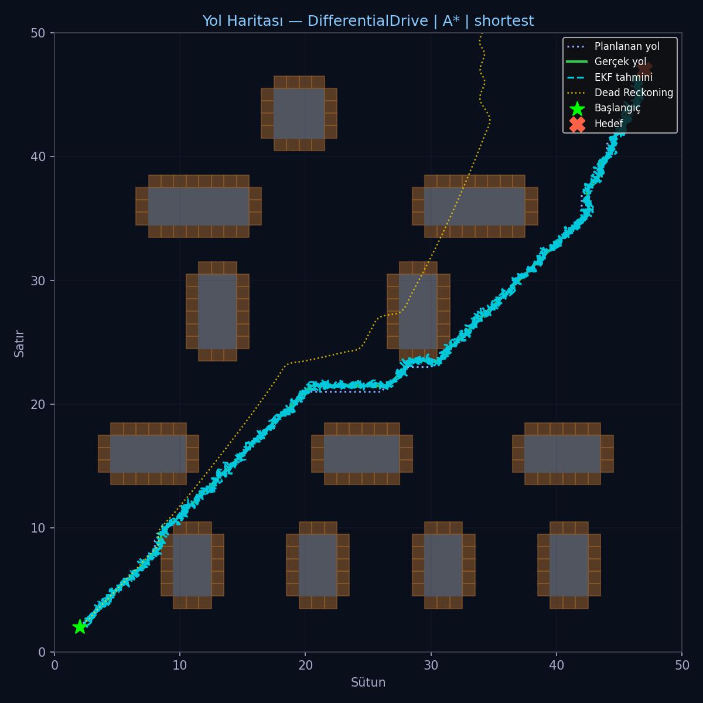

**LiDAR Sensör Görselleştirmesi (Ham vs Filtrelenmiş):**

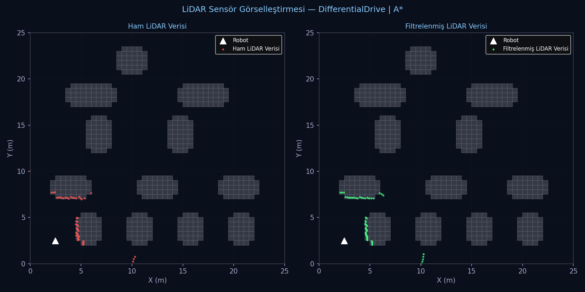

**Lokalizasyon Karşılaştırması (Gerçek Yol / EKF / Dead Reckoning):**

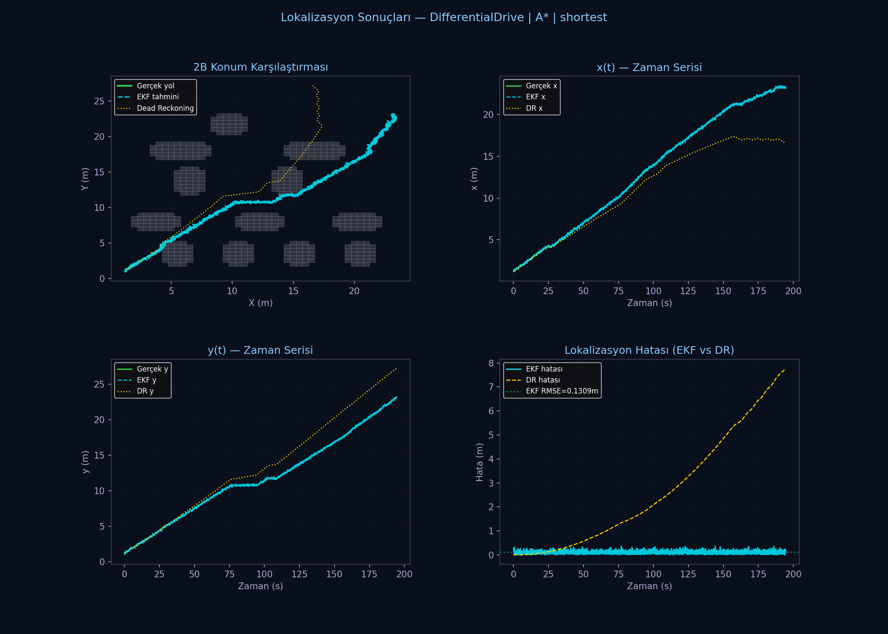

**Hata Analizi (Zaman Boyunca RMSE):**

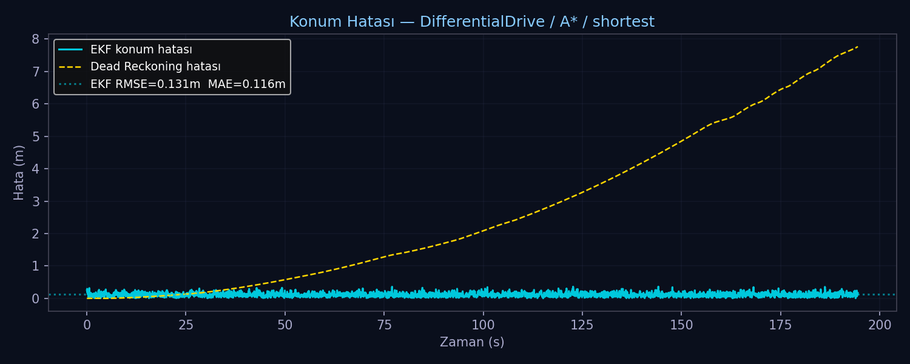

**11 Robot Karşılaştırma Raporu:**

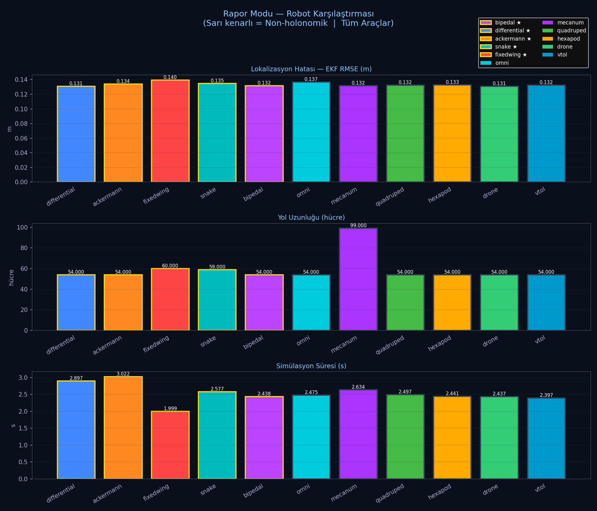

### 11 Robot — Performans Özeti

| Robot | Planlayıcı | Metrik | Kriter | RMSE (m) | Yol (hcr) | Süre (s) |
|---|---|---|---|---|---|---|
| differential | astar | euclidean | shortest | **0.1309** | **54** | 2.9 |
| ackermann | astar | euclidean | shortest | 0.1339 | 54 | 3.0 |
| fixedwing | astar | euclidean | safest | 0.1395 | 60 | 2.0 |
| snake | astar | manhattan | shortest | 0.1346 | 59 | 2.6 |
| bipedal | astar | euclidean | shortest | 0.1316 | 54 | 2.4 |
| omni | astar | chebyshev | shortest | 0.1367 | 54 | 2.5 |
| mecanum | dijkstra | manhattan | safest | 0.1318 | 99 | 2.6 |
| quadruped | astar | euclidean | shortest | 0.1324 | 54 | 2.5 |
| hexapod | astar | euclidean | shortest | 0.1327 | 54 | 2.4 |
| drone | astar | euclidean | shortest | 0.1310 | 54 | 2.4 |
| vtol | astar | euclidean | shortest | 0.1323 | 54 | 2.4 |

> En düşük EKF RMSE: **Differential Drive** (0.1309 m)

---

## Yapay Zeka Kullanım Beyanı

**Kullanılan araçlar:** GitHub Copilot (Claude Sonnet 4.6)

**Yapay zekanın kullanıldığı bölümler:**
- EKF ve sensör füzyon kodunun taslak oluşturulması
- Kod hata ayıklama desteği
- README ve rapor metni dil düzenlemesi

**Öğrencinin kendi katkıları:**
- Proje senaryosu ve sistem mimarisinin tasarlanması
- 11 robot modelinin kinematik denklemlerinin yazılması ve doğrulanması
- Tüm kodların çalıştırılması, test edilmesi ve düzeltilmesi
- Simülasyon parametrelerinin ayarlanması ve çıktı analizleri
- Sonuç yorumları ve hata analizinin hazırlanması

---

<details open>
<summary>🤖 Reaktif Planlayıcılar (Bug1, Bug2, Potential Fields)</summary>

| | Bug1 | Bug2 | Potential Fields |
|---|---|---|---|
| diff | 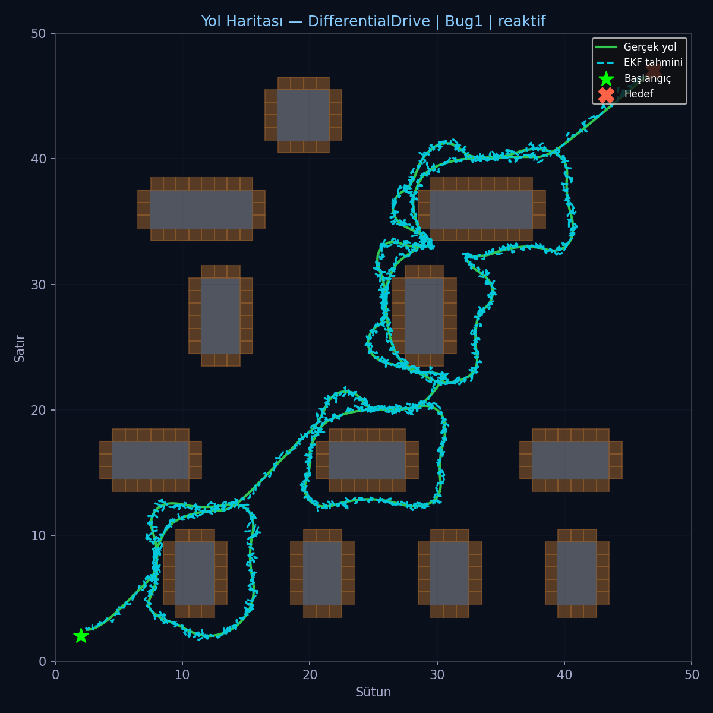 | 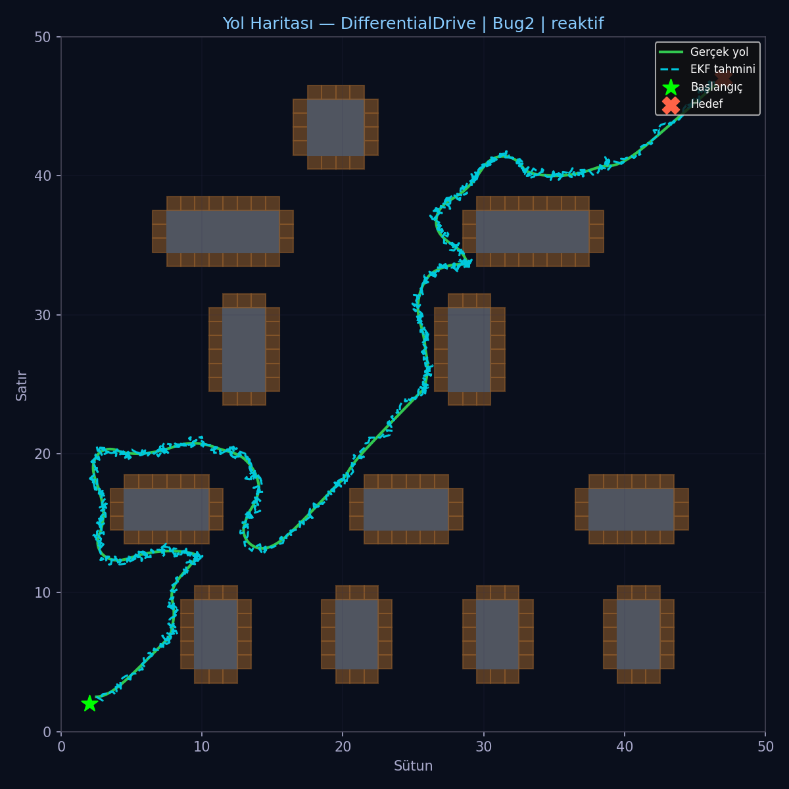 | 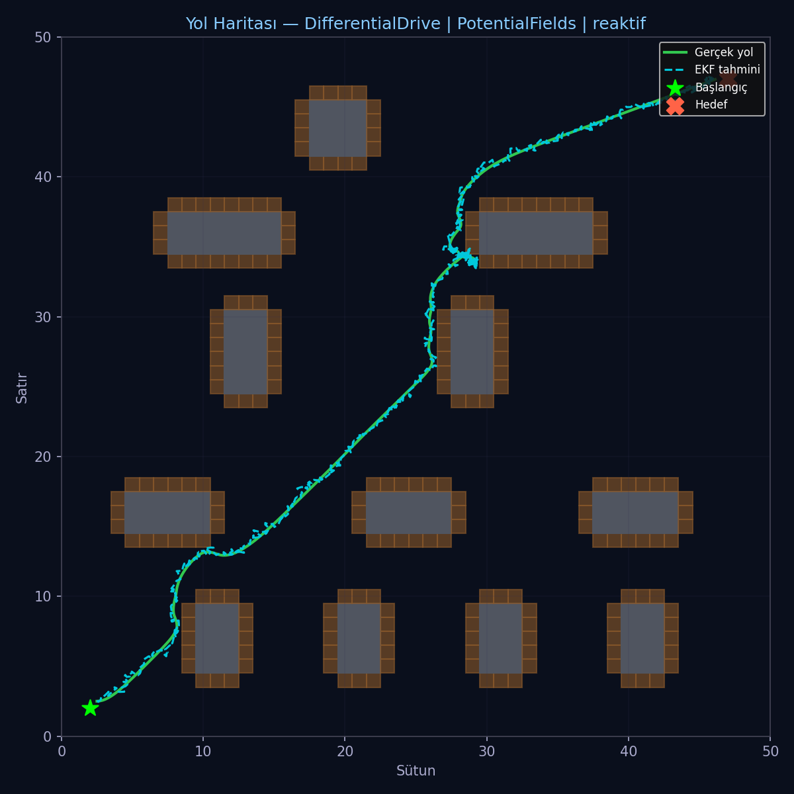 |

---

## Tamamlanan Simülasyon Kombinasyonları

Toplam **57 simülasyon**, **231 çıktı görseli** üretilmiştir.

### Tüm Kombinasyonlar

| Robot | Planlayıcı | Metrik | Kriter |
|---|---|---|---|
| differential | astar | chebyshev | shortest |
| differential | astar | diagonal | shortest |
| differential | astar | euclidean | shortest |
| differential | astar | euclidean | safest |
| differential | astar | manhattan | shortest |
| differential | astar | minkowski2 | shortest |
| differential | astar | minkowski3 | fastest |
| differential | astar | minkowski3 | safest |
| differential | astar | minkowski3 | shortest |
| differential | astar | minkowski3 | smoothest |
| differential | astar | octile | safest |
| differential | astar | octile | shortest |
| differential | rrt | minkowski2 | shortest |
| differential | bug1 | local | reaktif |
| differential | bug2 | local | reaktif |
| differential | potentialfields | local | reaktif |
| ackermann | astar | chebyshev | fastest |
| ackermann | astar | euclidean | shortest |
| ackermann | dijkstra | octile | shortest |
| fixedwing | astar | chebyshev | safest |
| fixedwing | astar | diagonal | safest |
| fixedwing | astar | euclidean | fastest |
| fixedwing | astar | euclidean | safest |
| fixedwing | astar | euclidean | shortest |
| fixedwing | astar | euclidean | smoothest |
| fixedwing | astar | manhattan | safest |
| fixedwing | astar | manhattan | shortest |
| fixedwing | astar | minkowski2 | safest |
| fixedwing | astar | minkowski3 | safest |
| fixedwing | astar | minkowski3 | shortest |
| fixedwing | astar | octile | safest |
| fixedwing | dijkstra | euclidean | shortest |
| fixedwing | dstar | diagonal | shortest |
| fixedwing | rrt* | minkowski3 | shortest |
| fixedwing | bug0 | local | reaktif |
| omni | astar | euclidean | safest |
| omni | astar | euclidean | shortest |
| omni | rrt | chebyshev | shortest |
| omni | potentialfields | local | reaktif |
| mecanum | astar | euclidean | shortest |
| mecanum | dijkstra | manhattan | safest |
| hexapod | astar | euclidean | shortest |
| hexapod | dstar | euclidean | shortest |
| quadruped | astar | euclidean | fastest |
| quadruped | dstar | diagonal | shortest |
| drone | astar | euclidean | shortest |
| drone | astar | manhattan | fastest |
| drone | rrt* | octile | shortest |
| snake | astar | euclidean | safest |
| snake | astar | euclidean | shortest |
| bipedal | astar | euclidean | shortest |
| vtol | astar | euclidean | shortest |
| vtol | dstar | diagonal | shortest |

---

### Galeriler

<details open>
<summary>🤖 11 Robot — Referans Koşu (A* + Euclidean)</summary>

| Differential | Ackermann | Fixed Wing |
|:---:|:---:|:---:|
|  | 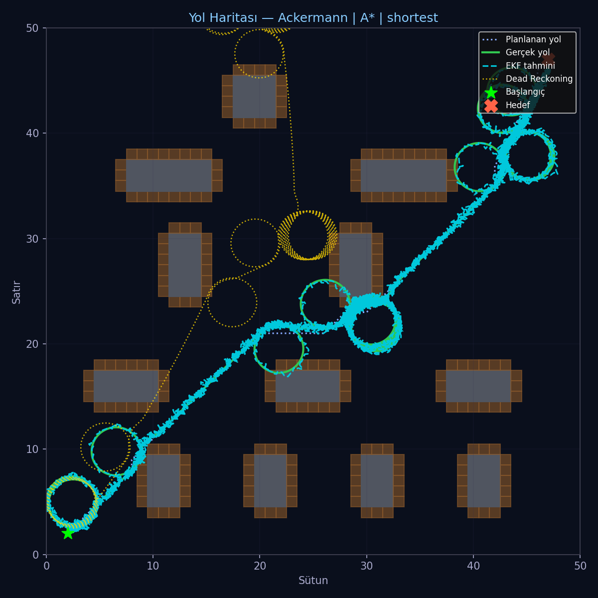 | 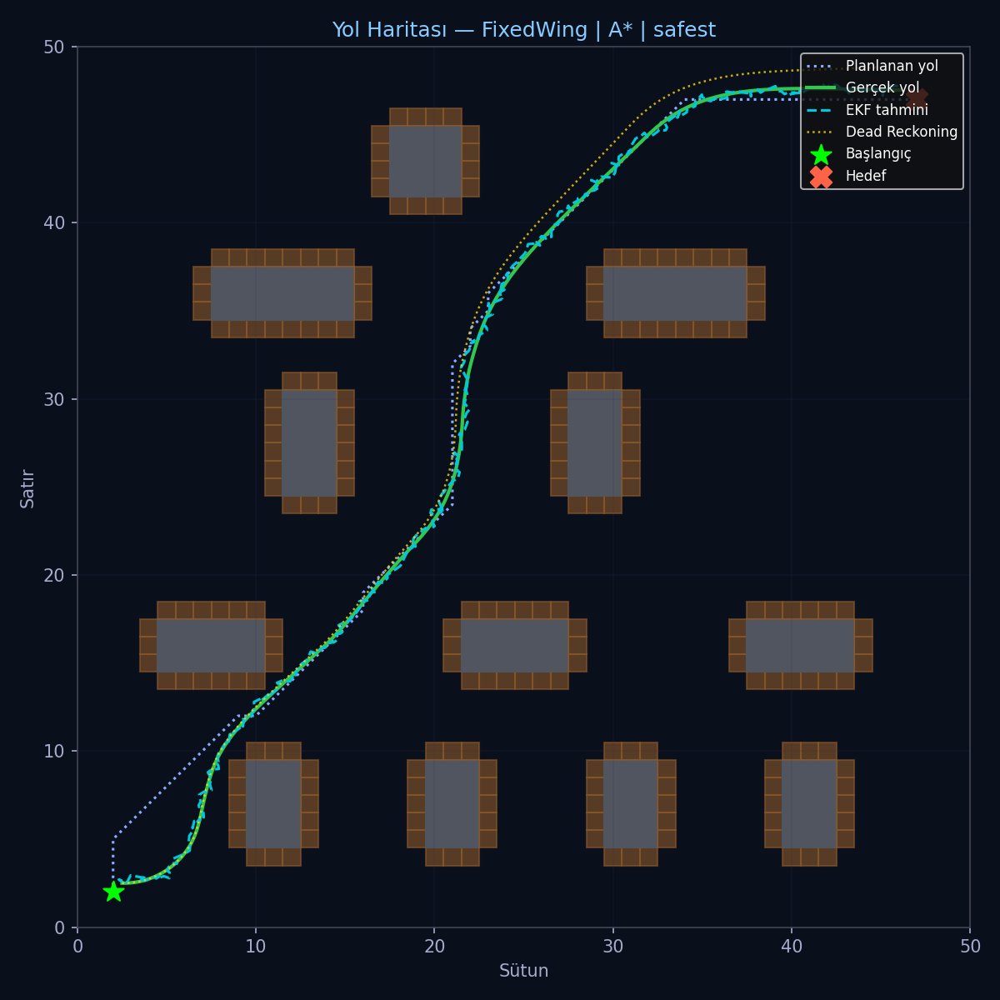 |
| **Omni** | **Mecanum** | **Hexapod** |
| 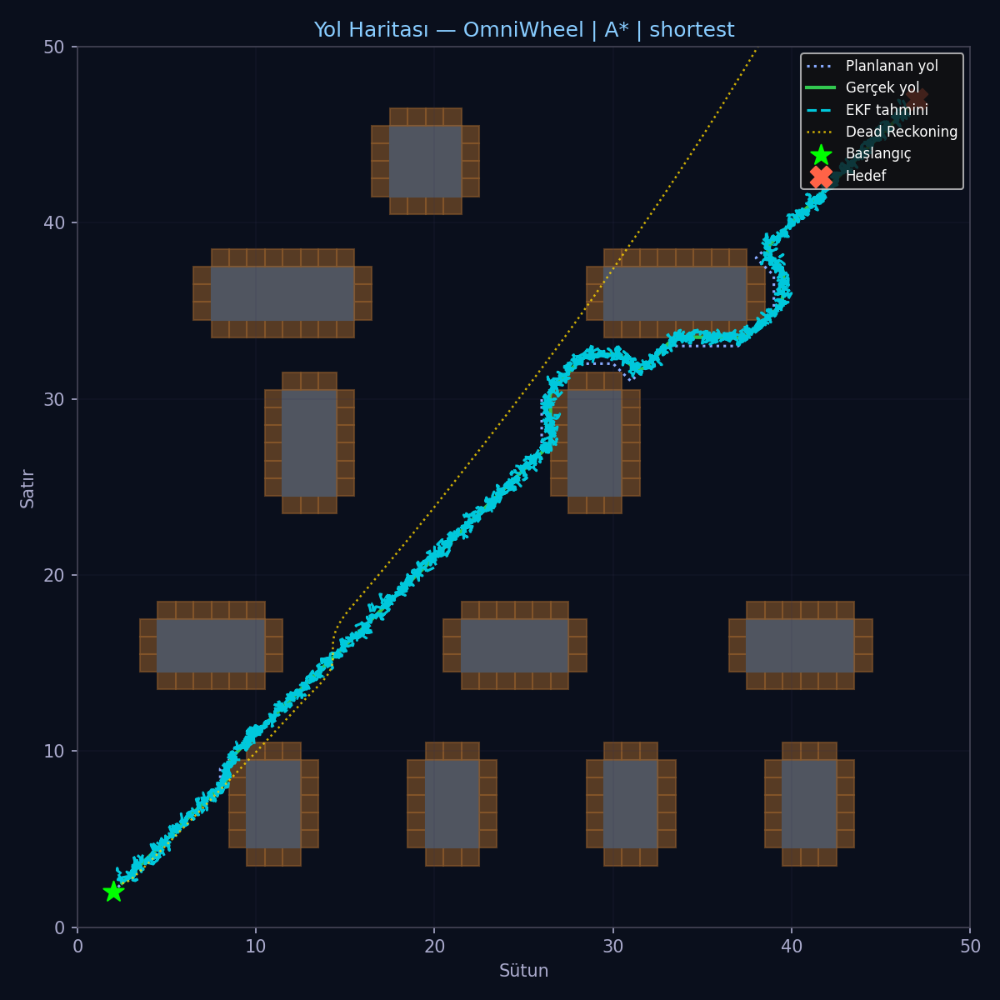 | 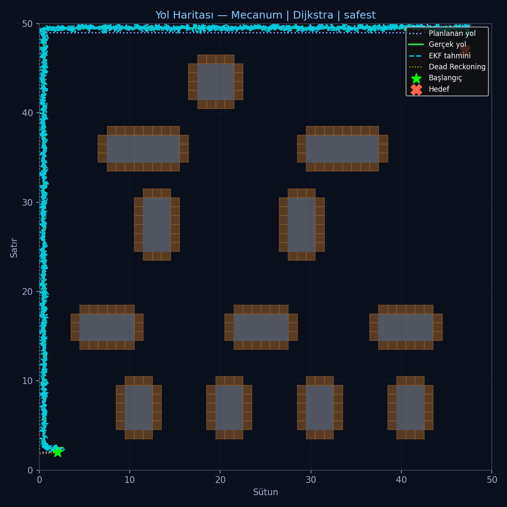 | 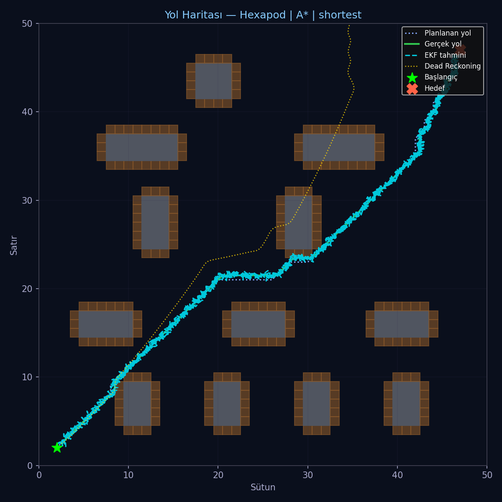 |
| **Drone** | **VTOL** | **Snake** |
|  |  | 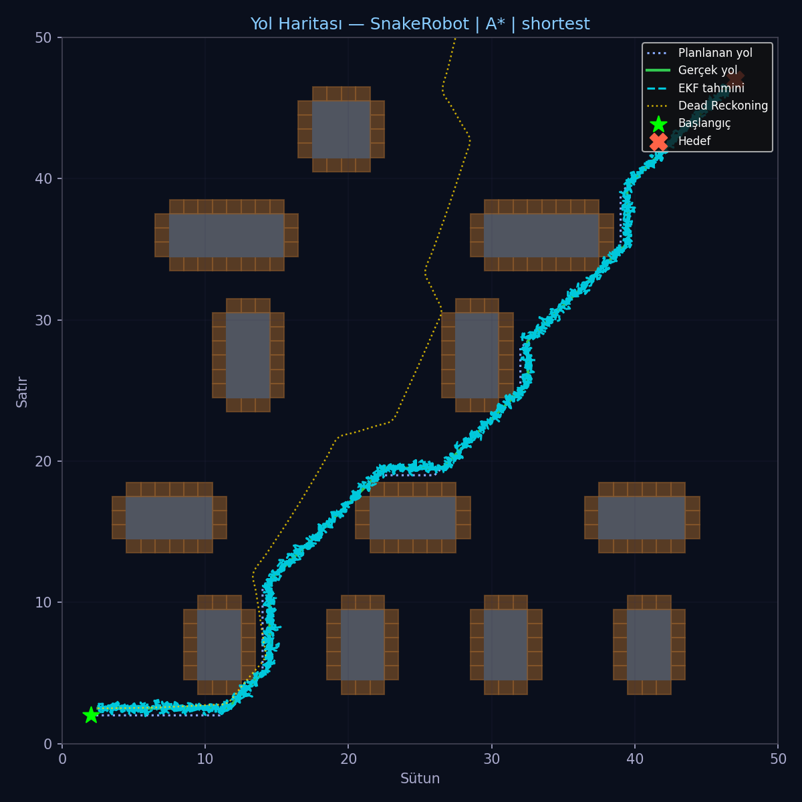 |
| **Quadruped** | **Bipedal** | |
| 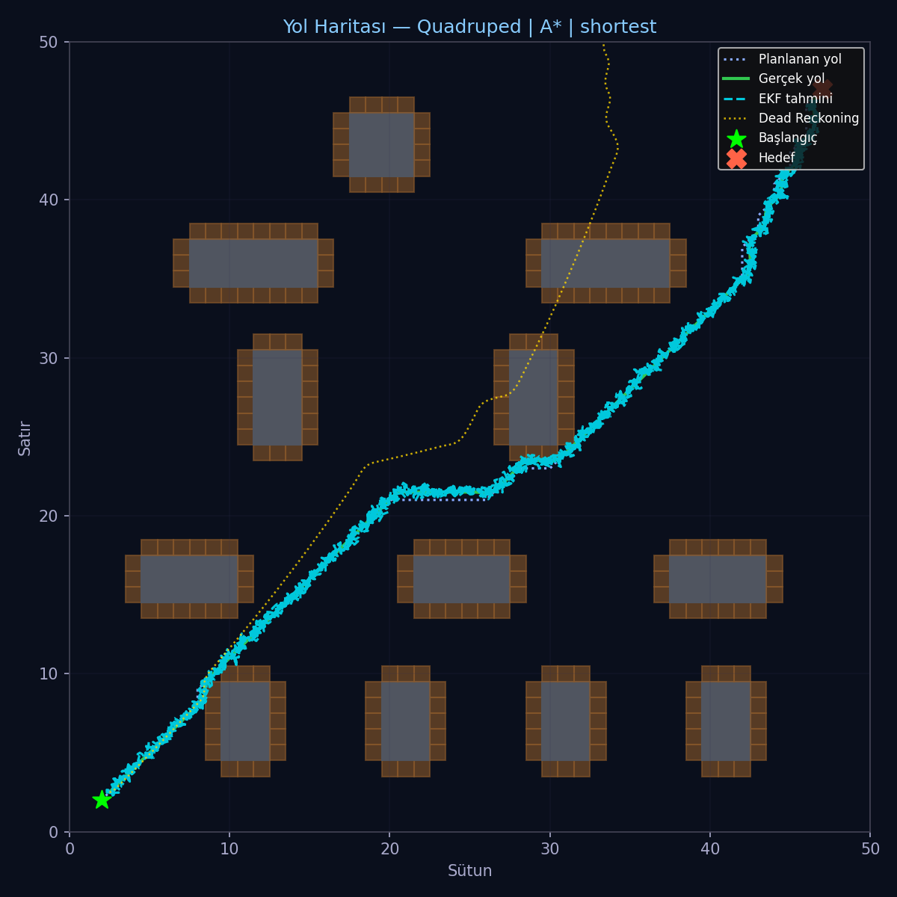 |  | |

</details>

<details open>
<summary>📐 Differential Drive — A* Mesafe Metriği Karşılaştırması</summary>

| Euclidean | Manhattan | Chebyshev |
|:---:|:---:|:---:|
|  |  |  |
| **Diagonal** | **Octile** | **Minkowski2** |
|  |  |  |
| **Minkowski3** | | |
|  | | |

</details>

<details open>
<summary>🎯 Differential Drive — Kriter Karşılaştırması (Minkowski3)</summary>

| Shortest | Safest | Fastest | Smoothest |
|:---:|:---:|:---:|:---:|
|  |  |  |  |

</details>

<details open>
<summary>🔄 Differential Drive — Planlayıcı Karşılaştırması</summary>

| A* (Euclidean) | RRT (Minkowski2) | Bug1 |
|:---:|:---:|:---:|
|  |  |  |
| **Bug2** | **Potential Fields** | |
|  |  | |

</details>

<details open>
<summary>✈️ Fixed Wing — Kapsamlı Test (16 Kombinasyon)</summary>

| A*+Euclidean+Shortest | A*+Euclidean+Safest | A*+Euclidean+Fastest |
|:---:|:---:|:---:|
|  |  |  |
| **A*+Euclidean+Smoothest** | **A*+Chebyshev+Safest** | **A*+Diagonal+Safest** |
|  |  |  |
| **A*+Manhattan+Safest** | **A*+Manhattan+Shortest** | **A*+Minkowski2+Safest** |
|  |  |  |
| **A*+Minkowski3+Safest** | **A*+Minkowski3+Shortest** | **A*+Octile+Safest** |
|  |  |  |
| **Dijkstra+Euclidean** | **D*+Diagonal** | **RRT*+Minkowski3** |
|  |  |  |
| **Bug0** | | |
|  | | |

</details>

<details open>
<summary>🎡 Omni Yönlü Robot</summary>

| A*+Euclidean+Shortest | A*+Euclidean+Safest | RRT+Chebyshev | Potential Fields |
|:---:|:---:|:---:|:---:|
|  |  |  |  |

</details>

<details open>
<summary>🚗 Ackermann — Mecanum</summary>

| Ackermann A*+Chebyshev+Fastest | Ackermann A*+Euclidean+Shortest | Ackermann Dijkstra+Octile |
|:---:|:---:|:---:|
|  |  |  |
| **Mecanum A*+Euclidean** | **Mecanum Dijkstra+Manhattan+Safest** | |
|  |  | |

</details>

<details open>
<summary>🦿 Hexapod — Quadruped — Bipedal</summary>

| Hexapod A*+Euclidean | Hexapod D*+Euclidean | Quadruped A*+Euclidean+Fastest |
|:---:|:---:|:---:|
|  |  |  |
| **Quadruped D*+Diagonal** | **Bipedal A*+Euclidean** | |
|  |  | |

</details>

<details open>
<summary>🚁 Drone (Quadrotor) — VTOL — Snake</summary>

| Drone A*+Euclidean | Drone A*+Manhattan+Fastest | Drone RRT*+Octile |
|:---:|:---:|:---:|
|  |  |  |
| **VTOL A*+Euclidean** | **VTOL D*+Diagonal** | **Snake A*+Euclidean** |
|  |  |  |
| **Snake A*+Euclidean+Safest** | | |
|  | | |

</details>

</details>

## Kaynaklar

[1] V. Ušinskis, M. Nowicki, A. Dzedzickis ve V. Bučinskas, "Sensor-fusion based navigation for autonomous mobile robot," *Sensors*, cilt 25, sayı 4, makale 1248, 2025, doi: 10.3390/s25041248.

[2] Y. Ou, Y. Cai, Y. Sun ve T. Qin, "Autonomous navigation by mobile robot with sensor fusion based on deep reinforcement learning," *Sensors*, cilt 24, sayı 12, makale 3895, 2024, doi: 10.3390/s24123895.

[3] B. Zhang ve C. Li, "The optimization and application research of the RRT-APF-based path planning algorithm," *Electronics*, cilt 13, sayı 24, makale 4963, 2024, doi: 10.3390/electronics13244963.
